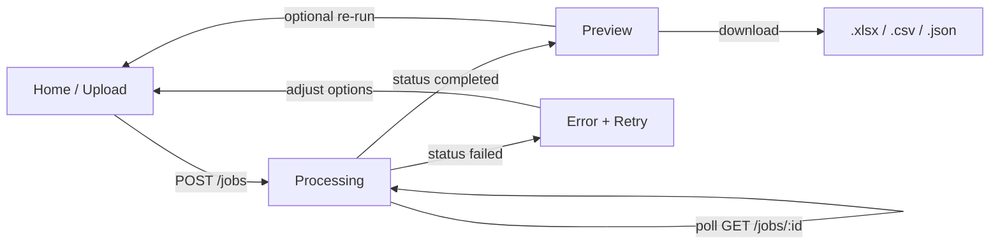
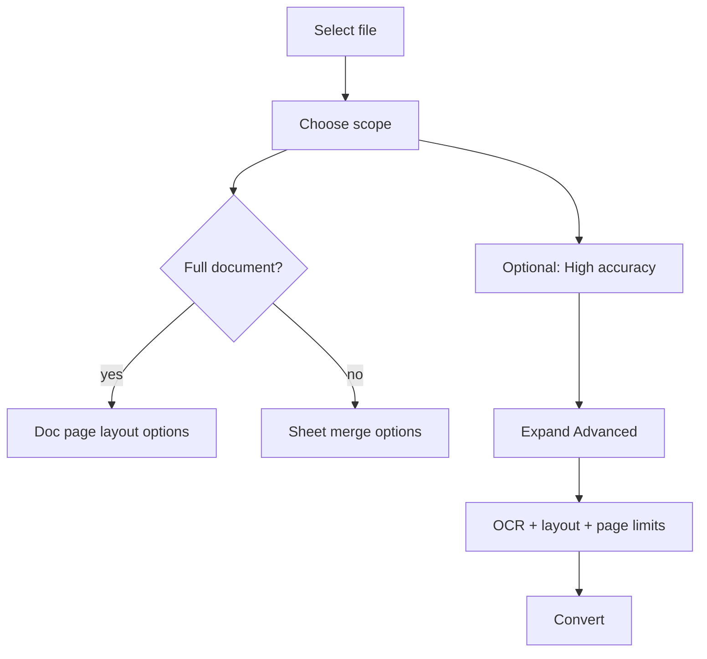

# Exceflow — SaaS UI/UX architecture (PDF → Excel)

This document translates product goals into **wireframes**, **routing**, **components**, **state**, and **API contracts**. It is aligned with a **Notion / Linear / Stripe**-style SaaS: calm surfaces, strong hierarchy, progressive disclosure.

**Visual reference:** light-first Material palette (cool paper background `#f8f9ff`, ink text `#0b1c30`, primary accent `#ae3200`, container blues, `active-card` orange border `#ff5a1f`). Dark mode remains supported via existing `next-themes` + CSS variables.

---

## 1. Full UI wireframe structure

### 1.1 Global shell (all pages)

```
┌──────────────────────────────────────────────────────────────┐
│ Header (fixed): Logo | Nav (Convert, …) | Theme | Auth        │
├──────────────────────────────────────────────────────────────┤
│ Main max-w ~1000–1280px, generous px-md / py-2xl             │
│ Optional: subtle “canvas” bg (#F8FAFC class from reference)   │
├──────────────────────────────────────────────────────────────┤
│ Footer: legal links, security note                            │
└──────────────────────────────────────────────────────────────┘
```

### 1.2 Home / upload (`/`)

Desktop (reference: **12 columns**, upload **7**, settings **5**):

```
┌─────────────────────────────┬─────────────────────────────┐
│ HERO (full width above grid) │                             │
│ H1 + one-line value prop     │                             │
│ Trust chips: scans · layout  │                             │
└─────────────────────────────┴─────────────────────────────┘
┌─────────────────────────────┬─────────────────────────────┐
│ LEFT: Upload card           │ RIGHT: Controls stack          │
│ • Illustration / icon        │ • Extraction scope (2 tiles) │
│ • Drag-drop zone             │ • High accuracy toggle         │
│ • Thumbnail after file pick  │ • Mode: Fast / Accurate        │
│ • “PDF · max 50MB”           │ • Sheet layout (conditional)  │
│                              │ • Advanced ▼ (collapsible)    │
│                              │ • Primary CTA + privacy line   │
└─────────────────────────────┴─────────────────────────────┘
```

**Beginner path:** pick file → scope (default **Tables only**) → optional **High accuracy** → Convert.

**Power user path:** expand **Advanced** for max pages, merge, headers/footers, layout strictness, OCR tier.

### 1.3 Processing (`/jobs/[id]/processing`)

```
┌──────────────────────────────────────────────────────────────┐
│ Job summary row: filename · scope · mode                      │
├──────────────────────────────────────────────────────────────┤
│ Stepper OR linear progress                                    │
│ 1 Uploading ✓  2 Detecting…  3 Tables…  4 OCR…  5 Building…   │
├──────────────────────────────────────────────────────────────┤
│ Cancel processing (secondary)    [ backed by API when exists ] │
└──────────────────────────────────────────────────────────────┘
```

### 1.4 Result preview (`/jobs/[id]/preview`) — **hero surface**

```
┌──────────────────────────────────────────────────────────────┐
│ Tabs: [ Tables ] [ Full document ] [ Raw extraction ▾ ]       │
├───────────────────────────┬──────────────────────────────────┤
│ PDF pane (left)           │ Excel pane (right)                │
│ • pdf.js viewport         │ • Hypergrid / canvas / images     │
│ • zoom                    │ • zoom                            │
│ • optional layout grid    │ • optional header/footer mask     │
├───────────────────────────┴──────────────────────────────────┤
│ Download: .xlsx | .csv | JSON (advanced) | Re-run options     │
└──────────────────────────────────────────────────────────────┘
```

Mobile: stack **status + download** only; link “Open preview on desktop.”

### 1.5 Error / retry state (modal or inline on job view)

```
Title: Couldn’t extract this PDF cleanly
Body: We detected a complex, scanned, or handwritten layout.
Actions: [ Retry with high accuracy ] [ Switch to full document ]
         [ Contact support ]
```

---

## 2. Component breakdown (React / Next.js)

### 2.1 App Router map

| Route | Server/Client | Purpose |
|-------|----------------|---------|
| `app/layout.tsx` | Server | Fonts, theme provider, shell |
| `app/page.tsx` | Client | Upload + options + submit |
| `app/jobs/[jobId]/processing/page.tsx` | Client | Polling + step UI |
| `app/jobs/[jobId]/preview/page.tsx` | Client | Split preview + downloads |
| `app/jobs/[jobId]/error/page.tsx` | Client | Retry UX (optional segment) |

Shared layout group: `app/(app)/layout.tsx` if you add marketing pages later.

### 2.2 `components/exceflow/` (prefixed; keeps shadcn `ui/` generic)

| Component | Responsibility |
|-----------|----------------|
| `ExceflowSiteHeader` | Nav, theme toggle, auth placeholders |
| `ExceflowSiteFooter` | Legal, trust |
| `ExceflowTrustBar` | Chips: “Better than iLovePDF for complex PDFs”, scans, layout |
| `ExceflowUploadCard` | Left column: illustration slot, dropzone, thumbnail (`URL.createObjectURL`) |
| `ExceflowModeTiles` | Scope: Tables only vs Full document (card buttons + `active-card` style) |
| `ExceflowAccuracySwitch` | “High accuracy (OCR + AI)” — maps to `mode=accurate` + copy |
| `ExceflowSpeedModeTiles` | Fast vs Accurate (reference: bolt / high_quality) |
| `ExceflowSheetLayoutTiles` | Single sheet vs per page (when scope = tables only; else doc layout) |
| `ExceflowAdvancedPanel` | Collapsible `Card`; sliders & switches (see section 3 state) |
| `ExceflowProcessingStepper` | Steps driven by job `status` + backend `stage` field (future) |
| `ExceflowCancelJobButton` | `DELETE /jobs/:id` or `POST /jobs/:id/cancel` when implemented |
| `ExceflowPreviewSplit` | Resizable panels (e.g. `react-resizable-panels`) |
| `ExceflowPreviewPdfPane` | pdf.js wrapper, zoom, scroll ref |
| `ExceflowPreviewExcelPane` | Phase 1: table screenshot tiles; Phase 2: Handsontable / AG Grid read-only |
| `ExceflowPreviewTabs` | Tables / Full doc / Raw |
| `ExceflowDownloadMenu` | `.xlsx` primary; `.csv` / `.json` secondary |
| `ExceflowErrorRecovery` | Retry CTAs |

### 2.3 `components/ui/` (shadcn)

Extend as needed: `tabs`, `switch`, `slider`, `collapsible`, `progress`, `sheet` (mobile drawer), `tooltip`, `scroll-area`, `dropdown-menu`.

---

## 3. State management plan

### 3.1 Principles

- **URL is source of truth for job identity:** `/jobs/[jobId]/…`
- **Server state:** React Query (recommended) or lightweight `fetch` + `useEffect` (current) for `GET /jobs/:id`
- **Upload wizard state:** local `useState` on `/` until POST returns `jobId`, then `router.push`
- **Preview UI state (ephemeral):** `useReducer` or small Zustand slice: zoom, active tab, highlight IDs, grid toggles — **not** persisted unless user saves preference

### 3.2 Client state shape (TypeScript)

```ts
// Wizard (home page, pre-submit)
type WizardState = {
  file: File | null;
  filePreviewUrl: string | null;
  extractionScope: 'tables_only' | 'full_document';
  highAccuracySelected: boolean; // UX flag; submit sets mode=accurate if true
  mode: 'fast' | 'accurate';
  outputLayout: 'merged' | 'split';
  fullDocumentPages: 'single_sheet' | 'per_page';
  advancedOpen: boolean;
  advanced: {
    maxPages: number | null;
    mergeDuplicateHeaders: boolean;
    stripRepeatingHeadersFooters: boolean;
    preserveLayoutStrict: boolean;
    ocrTier: 'off' | 'standard' | 'high';
  };
};

// Preview pane (job page)
type PreviewUiState = {
  tab: 'tables' | 'full_document' | 'raw';
  pdfZoom: number;
  excelZoom: number;
  scrollSync: boolean;
  showLayoutGrid: boolean;
  showHeaderFooter: boolean;
  selectedRegionId: string | null; // bidirectional highlight
};
```

**Note:** Several `advanced` fields are **UX placeholders** until the API accepts them (see backend alignment below).

### 3.3 Job lifecycle (derived from API)

```
idle → uploading → queued → processing → completed | failed
```

Polling interval: 1–2s while `processing`; backoff when tab hidden.

---

## 4. Page flow diagram



**Depth path for advanced users:**



---

## 5. Reference HTML → implementation mapping

| Reference element | Implementation |
|-------------------|------------------|
| `canvas-bg` / `bg-surface` | `--exceflow-body-base-*` light tokens + optional `bg-slate-50`-like utility |
| White upload card, `border-outline-variant` | shadcn `Card` + border token |
| `active-card` (2px `#ff5a1f`) | Selected tile: `ring-2 ring-[#ff5a1f]` or map to `--color-primary-container` |
| Primary CTA `primary-container` | `Button` variant `default` with reference orange |
| 7/5 grid at `lg` | `lg:grid-cols-12` + `lg:col-span-7` / `5` |
| Fixed header 64px | `h-16` + `pt` on main to match reference `pt-[96px]` if hero spacing added |
| Illustration | Next `Image` or static asset; exclude if bundle size concerns |

---

## 6. Backend alignment (honest scope)

**Implemented today:** `POST /jobs` (multipart: `mode`, `output_layout`, `extraction_scope`, `full_document_pages`), `GET /jobs/:id`, `GET /jobs/:id/download` (xlsx).

**Required for spec completeness (roadmap):**

| Feature | Suggested API / artifact |
|---------|-------------------------|
| Processing steps | `GET /jobs/:id` includes `stage`, `progress`, `stages[]` |
| Cancel | `POST /jobs/:id/cancel` or `DELETE /jobs/:id` |
| PDF preview URL | Signed URL or `GET /jobs/:id/source` |
| Excel preview | `GET /jobs/:id/preview.xlsx` or rendered JSON grid + `GET /jobs/:id/grid` |
| CSV / JSON export | `GET /jobs/:id/download?format=csv|json` |
| Advanced flags | additional `Form` fields + pipeline support |
| Highlight mapping | structured `regions[]` with bbox + cell range |

The UI should be built so **preview and advanced controls are real components** with **mocked adapters** until endpoints exist.

---

## 7. Differentiation copy (persistent, subtle)

Placement: under H1, or as 3 compact chips above the grid:

1. **“Built for complex PDFs — not just digital tables.”**
2. **“Scanned & handwritten-friendly OCR pipeline.”**
3. **“Full-document layout, not a plain text dump.”**

Avoid competitor naming in production footer if legal prefers; internal design may reference iLovePDF for positioning.

---

## 8. Accessibility & performance UX

- **Focus order:** Upload → Scope → Accuracy → Mode → Layout → Advanced → CTA.
- **Announce** step changes with `aria-live="polite"` on processing view.
- **Cancel** clearly disables download paths.
- **Preview:** keyboard pan/zoom hooks; skip sync scroll if `prefers-reduced-motion`.

---

## 9. Implementation phases (recommended)

1. **Phase UI-A:** Restyle home to reference layout (7/5, `active-card`, trust chips) — maps to current API only.
2. **Phase UI-B:** `/jobs/[id]/processing` + stepper driven by minimal `stage` field.
3. **Phase UI-C:** Preview shell + PDF side + Excel placeholder; highlight mapping when `regions` API lands.
4. **Phase UI-D:** Advanced panel wired to API; CSV/JSON downloads.

---

This file is the single place that ties **product intent**, **layout**, **components**, and **state** to your stack. Update the backend alignment section as APIs ship.
